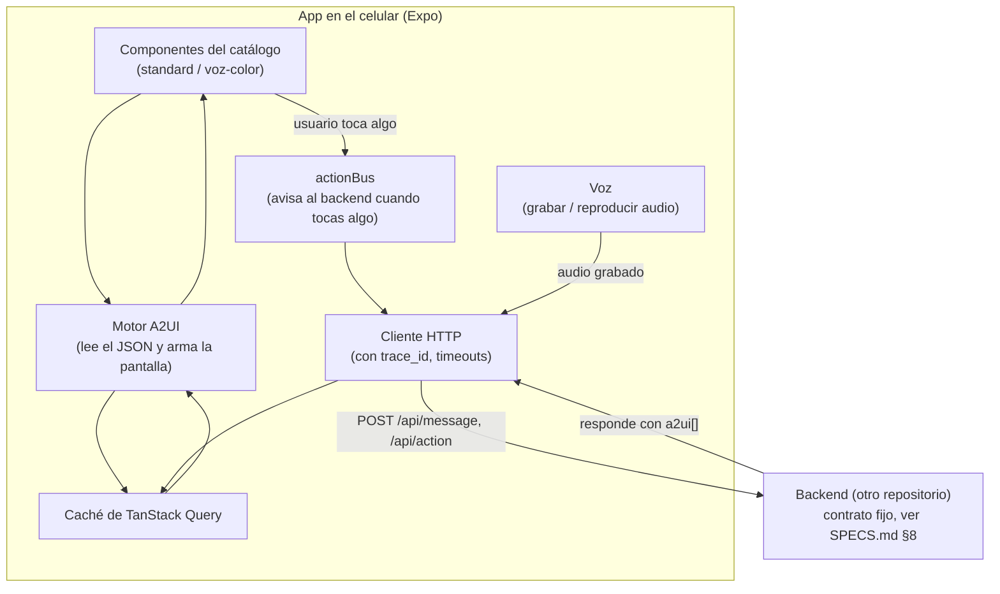

# ARQUITECTURA_MOBILE.md — Guía de arquitectura del frontend mobile (explicada)

> **Este documento NO es la fuente de verdad.** Es una traducción al español de `MOBILE_ARCHITECTURE.md`, con explicaciones extra pensadas para alguien que apenas está agarrando confianza como developer. Si algo aquí contradice a `MOBILE_ARCHITECTURE.md` (inglés), **gana el inglés** — repórtalo para corregirlo, no lo sigas.
>
> Úsalo así: lee una sección aquí para entender el *por qué*, y cuando vayas a escribir código, confirma el detalle exacto (nombres de archivo, tipos, endpoints) en `MOBILE_ARCHITECTURE.md` y `SPECS.md`.

---

## 0. Antes que nada: ¿qué estamos construyendo y por qué así?

El producto (`SPECS.md`, `AGENTS.md`) es un asistente financiero por voz. Lo raro — y lo que hace esto distinto a una app normal — es que **el agente (el LLM) decide qué pantalla mostrarte, en el momento, según lo que dijiste y tu situación real**. No existen 20 pantallas fijas que el diseñador dibujó de antemano. El backend le manda al celular un mensaje en un formato llamado **A2UI** (una lista de componentes en JSON: "pon una tarjeta con este texto, un botón que diga tal cosa, un slider de 0 a 100..."), y el celular tiene que **construir la pantalla en vivo a partir de ese JSON**.

Esto cambia todo el diseño de la app mobile. No estamos armando pantallas normales donde tú, como developer, decides "aquí va un botón rojo que dice Aceptar". Estamos armando un **motor que sabe interpretar JSON y convertirlo en pantalla**, más un catálogo de piezas (componentes) que ese motor puede usar. Si entiendes eso, entiendes el 80% de esta arquitectura.

**Dónde vive cada cosa:**
- Este repositorio (`hackmtyfront`) = **solo el frontend mobile**. Es una app de Expo (React Native), full-stack de este repo.
- El backend (Python, FastAPI, el agente, la base de datos) vive en **otro repositorio**. Nosotros nunca tocamos su código — solo le hacemos peticiones HTTP (`SPECS.md` §8).
- Antes de arrancar de verdad, hay que mover o borrar el prototipo web (Vite) que está en la raíz de este repo ahorita — era solo una prueba de Figma-to-code, no es la app real.

---

## 1. Glosario rápido (para no perderte en el resto del documento)

- **REST / API HTTP:** la forma más común de que dos programas se hablen por internet: mandas una petición (`POST /api/message` con un JSON), recibes una respuesta (otro JSON). No hay conexión abierta todo el tiempo (eso serían WebSockets, que aquí **no** se usan — `INV-010`).
- **A2UI:** el "idioma" en el que el backend describe una pantalla. Es una lista (`a2ui[]`) de objetos JSON, cada uno con un `type` ("tipo de componente") y datos. El celular lee esa lista y decide qué dibujar.
- **Catálogo (catalog):** el conjunto de componentes visuales que nosotros programamos (tarjetas, botones, inputs, alertas...). El backend nunca manda código ni estilos, solo dice "quiero un componente de tipo `BreakAlert` con estos datos" — nosotros ya tenemos programado qué se ve un `BreakAlert`.
- **Registry (registro):** un diccionario en código: `{ "BreakAlert": ComponenteBreakAlert, "Card": ComponenteCard, ... }`. Es lo que conecta el JSON del backend con el componente real de React que se dibuja.
- **Loop cerrado (closed loop):** cuando el usuario toca algo en la pantalla generada, eso **no se queda solo en el celular** — se le avisa al backend ("el usuario presionó este botón"), el agente decide qué sigue, y manda una **pantalla nueva completa**. La conversación nunca termina en una sola pantalla estática.
- **Server state vs. UI state:** dos tipos de "estado" (datos que cambian) que se manejan distinto:
  - *Server state* = datos que viven en el backend y el celular solo tiene una copia/caché (ej: la pantalla actual, los datos de una bolsa de ahorro). Se maneja con **TanStack Query**.
  - *UI state* = cosas que solo le importan al celular en este momento (ej: "¿estoy grabando audio?", "¿está abierto el panel de debug?"). Se maneja con **Zustand**.
- **MCP:** un protocolo que usa el backend para hablar con sus propias fuentes de datos (finanzas, ahorros, voz). **Esto es 100% del otro repo** — la app mobile nunca usa MCP directamente, ni le importa que exista.
- **Trace ID:** un identificador único que viaja en cada petición, para poder rastrear "qué pasó" si algo se rompe durante la demo.

---

## 2. Decisión de stack — qué usamos y por qué (explicado)

| Parte | Qué usamos | Por qué (explicado para jr) |
|---|---|---|
| Framework | **Expo (React Native) + TypeScript** | React Native te deja escribir la app en JavaScript/TypeScript con componentes tipo React, pero en vez de dibujar HTML, dibuja vistas nativas reales de iOS/Android. Expo es una capa sobre React Native que te evita configurar Xcode/Android Studio a mano — trae herramientas para compilar, correr en tu teléfono al instante (escaneando un QR), y publicar. |
| Navegación | **Expo Router** | En vez de configurar manualmente "esta ruta va a esta pantalla" en un archivo gigante, cada archivo dentro de `app/` **es** una pantalla, y el nombre del archivo define la URL/ruta. Ej: `app/saving-bags/[id].tsx` es la pantalla de una bolsa de ahorro específica. Menos configuración, más rápido de armar en un hackathon. |
| Estilos | **NativeWind** (Tailwind, pero para React Native) | Te deja escribir `className="bg-red-500 p-4 rounded-xl"` en vez de armar objetos de estilos a mano. **Ojo:** esto es una herramienta para escribir CSS más rápido, *no* es una librería de componentes (no viola la regla de "sin librerías de componentes de terceros", `INV-016`) — sigue siendo tú quien programa cada componente. |
| Datos del servidor | **TanStack Query** | Cuando pides datos a una API, necesitas manejar: "¿ya los tengo en caché?", "¿está cargando?", "¿hubo error?", "si cambian, refréscalos". TanStack Query hace todo eso por ti con muy poco código, en vez de que tú programes esa lógica a mano con `useState`/`useEffect` (que es propenso a bugs). |
| Estado local | **Zustand** | Una alternativa mucho más simple que Redux para guardar cosas como "¿está grabando el micrófono ahora mismo?". Es literalmente unas cuantas líneas para crear un "store" (una cajita de estado compartida entre pantallas). |
| Red / HTTP | `fetch` envuelto en un archivo propio | No usamos `axios` (una librería popular para hacer peticiones HTTP) porque `fetch` ya viene incluido y hace exactamente lo que necesitamos; agregar una librería extra solo para esto es peso innecesario. Armamos un solo archivo (`api/client.ts`) que decide la URL base, agrega el `trace_id`, maneja timeouts — así todos los demás archivos solo llaman una función simple, sin repetir esa lógica en cada pantalla. |
| Guardar datos sensibles | `expo-secure-store` | El único dato "sensible" que guardamos es el `session_id` (identifica tu sesión). Este paquete lo guarda cifrado en el dispositivo, no en texto plano. |
| Audio | `expo-av` (o `expo-audio`) | Para grabar tu voz (y mandarla al backend para transcribirla) y para reproducir el audio que el backend genera (texto-a-voz). |
| Compilar y publicar | **EAS Build** + **EAS Update** + **TestFlight** | Explicado a fondo en la §9. En corto: compila la app "en la nube" (sin que tú necesites una Mac para iOS) y te deja compartir la app instalable por link/QR. |
| Catálogo de componentes | 100% hecho por nosotros, dos versiones (`standard` y `voz-color`) | Regla del proyecto: no usar librerías de componentes prefabricados (nada de "React Native Paper", "NativeBase", etc.) — cada componente visual lo programamos nosotros desde cero, usando solo las piezas básicas de React Native (`View`, `Text`, `Pressable`...). |

---

## 3. Estructura de carpetas (en la raíz del repo)

No hay una carpeta `/mobile` — **todo el repo es la app**, como cualquier proyecto de Expo normal:

```
/ (raíz del repo)
  app/                          Rutas de Expo Router (cada archivo = una pantalla)
    _layout.tsx                 Configuración raíz: providers de React Query, sesión, tema
    index.tsx                   Pantalla de entrada: crea/recupera la sesión, te manda a la primera pantalla generada
    surface/[surfaceId].tsx     Pantalla GENÉRICA — renderiza cualquier cosa que el agente haya mandado
    negotiation/[session].tsx   Pantalla de "El Revés" (la negociación en vivo)
    saving-bags/index.tsx       Lista de bolsas de ahorro
    saving-bags/[id].tsx        Detalle de una bolsa (preguntas, avance)
    debug/kill-test/[surfaceId].tsx   Pantalla del "Kill Test" (ver §8)
    debug/trace/[traceId].tsx   Inspector de trazas (solo en desarrollo)

  src/
    a2ui/                       El "motor" que convierte JSON en pantalla — el corazón de la app (ver §4)
      types.ts                  Los tipos de TypeScript que describen un mensaje A2UI
      parser.ts                 Revisa que el JSON que llegó tenga sentido antes de usarlo
      registry.ts                El "diccionario" tipo→componente
      renderer.tsx               El componente `<A2UISurface />` que recorre la lista y dibuja cada nodo
      actionBus.ts                Cuando el usuario toca algo, este archivo le avisa al backend y actualiza la pantalla con la respuesta

    catalog/                    Las piezas visuales reales (los "Legos" con los que se arma cada pantalla)
      standard/                 Catálogo normal (Card, BreakAlert, Timeline, Button, TextInput...)
      voz-color/                Catálogo accesible: mismo significado, pero alto contraste, íconos grandes, botones grandes
      shared/                   Colores, tamaños, tipografía — compartidos por ambos catálogos

    features/                   La lógica de cada parte del producto, agrupada por tema
      session/                  Arranca la sesión, detecta si el usuario necesita el catálogo accesible
      la-mesa/                  Flujo de deuda: elegir estrategia, alerta cuando el plan "se rompe", reparar el plan
      el-reves/                 La negociación (rondas, "tomar control")
      saving-bags/               Crear una bolsa de ahorro, responder preguntas, ver el plan
      voice/                     Grabar/reproducir audio
      caja-de-cristal/           El panel de "por qué estoy viendo esto"
      kill-test/                 Ver una pantalla congelada, sin el agente

    api/                        Todo lo relacionado a hablar con el backend
      client.ts                  La función base que hace las peticiones HTTP
      endpoints.ts                Una función por cada endpoint del backend (`POST /api/message`, etc.)
      types.ts                    Los tipos de las peticiones/respuestas, calcados del contrato del backend

    state/                      Los "stores" de Zustand y la configuración de TanStack Query

    theme/                      Colores, espaciados, tipografías — la fuente única de verdad visual

  assets/                       Ícono de la app, splash screen, sonidos
  app.config.ts                 Configuración de Expo (incluye la URL del backend según el ambiente)
  eas.json                      Perfiles de compilación (desarrollo / interno / producción)
```

---

## 4. Cómo fluyen los datos (diagrama)



Léelo así: **todo lo que ves en pantalla vino del backend como JSON**. El celular nunca "inventa" estructura de pantalla — solo la dibuja. Y cuando tocas algo, esa acción viaja de regreso al backend, que decide qué sigue y manda una pantalla nueva completa (nunca un "parche" — siempre la lista entera de componentes, `REQ-LOOP-05`).

---

## 5. El motor A2UI — la parte más importante (explicada paso a paso)

Esta es la pieza que hace que la app "sea inteligente" en vez de una app normal con pantallas fijas. Vale la pena entenderla bien.

### El problema que resuelve

El backend te manda algo como:

```json
[
  { "id": "1", "type": "Card", "props": { "title": "Tu plan de pagos" } },
  { "id": "2", "type": "BreakAlert", "props": { "month": 8, "reason": "..." } }
]
```

¿Cómo conviertes eso en componentes reales de React Native? Podrías escribir un `if/else` gigante o un `switch` con un caso por cada `type`. **Eso no escala** — cada vez que se agrega un componente nuevo, tendrías que ir a buscar ese switch y modificarlo, y se puede repetir en muchos archivos por accidente.

### La solución: un registro (registry)

En vez de un switch, hacemos un objeto que mapea el nombre del tipo al componente de React que lo dibuja:

```ts
// src/a2ui/registry.ts
const registry = {
  Card: CardComponent,
  BreakAlert: BreakAlertComponent,
  Tradeoff: TradeoffComponent,
  // ...un renglón por cada componente del catálogo
};
```

Y el "motor" (`renderer.tsx`) simplemente recorre la lista que mandó el backend y, por cada nodo, busca en el registro qué componente usar:

```ts
// src/a2ui/renderer.tsx
export function A2UISurface({ a2ui, catalogId }) {
  const registry = catalog[catalogId]; // standard o voz-color
  return (
    <>
      {a2ui.map((node) => {
        const Component = registry[node.type];
        if (!Component) return <UnknownNodeFallback node={node} />; // nunca truena, aunque no lo reconozca
        return <Component key={node.id} node={node} />;
      })}
    </>
  );
}
```

**¿Por qué esto es mejor?** Porque agregar un componente nuevo es agregar **un renglón** al registro, no tocar el motor. Y porque ningún otro archivo de la app necesita saber qué tipos de componentes existen — solo el registro.

### Reglas para no romper esto (por qué existen)

1. **Solo el registro conoce los tipos de componente.** Ninguna pantalla debería preguntar "¿este nodo es de tipo X?" — solo debe renderizar `<A2UISurface />` y dejar que el registro decida. Si empiezas a hacer `if (node.type === 'BreakAlert')` fuera del registro, ya rompiste el patrón.
2. **Cuando el usuario toca algo, el componente solo llama a `actionBus.dispatch(...)`** — nunca hace su propia petición HTTP. Así, si mañana cambia cómo se manda una acción al backend, solo se toca un archivo (`actionBus.ts`), no cuarenta componentes distintos.
3. **La respuesta de una acción siempre reemplaza la pantalla completa**, nunca la "mezcla" con lo que ya había. Esto es importante: significa que el celular nunca tiene que adivinar cómo combinar lo viejo con lo nuevo — el backend siempre manda la verdad completa.
4. **Si llega un `type` que no reconocemos, se muestra un aviso visible, no un crash.** En un hackathon de 24 horas, el backend y el mobile se van a desincronizar en algún momento (alguien agrega un componente nuevo del lado del backend y se le olvida avisar). Con esta regla, la demo no se cae — simplemente ese pedazo se ve como "no reconocido" y el resto de la pantalla sigue funcionando.
5. **Los tipos de TypeScript (`a2ui/types.ts`) se copian de la especificación oficial de A2UI, nunca se inventan.** Si backend y mobile no coinciden en cómo se ve un mensaje A2UI, la demo se rompe — y ese es el riesgo #1 de todo este proyecto.

---

## 6. Dos catálogos, un mismo significado

`REQ-ACC-02` pide que, si el usuario tiene una necesidad de accesibilidad marcada en su cuenta (ej: persona mayor, con baja visión), la app **automáticamente** use otro catálogo (`voz-color`): más contraste, íconos más grandes, botones más grandes, y lee todo en voz alta.

La forma de que esto no se desincronice: **ambos catálogos tienen que implementar exactamente los mismos tipos de componente** (`Card`, `BreakAlert`, etc.) — solo que se ven distinto. Si programas un componente nuevo en `standard/` y se te olvida hacer su versión en `voz-color/`, TypeScript debería marcarte un error (porque ambos catálogos están tipados contra el mismo "contrato"), en vez de que el error aparezca hasta que alguien pruebe el modo accesible en vivo durante la demo.

---

## 7. Datos del servidor vs. estado local (para que no se te mezclen)

Esto confunde mucho a quienes empiezan: **no todo el "estado" de la app es igual**.

- **Datos que vienen del backend** (la pantalla actual, el detalle de una bolsa de ahorro): se guardan con **TanStack Query**, usando una "llave" como `["surface", surfaceId]`. Query se encarga de la caché, de saber si está cargando, de reintentar si falla, etc. — tú casi no escribes lógica de esto a mano.
- **Cosas que solo le importan al celular ahora mismo** (¿está grabando?, ¿está abierto el panel de debug?): van en **Zustand**, que es mucho más simple que Query porque no involucra al servidor.

**Regla importante:** no "adivinamos" cómo se va a ver la pantalla antes de que el backend responda (nada de actualizaciones optimistas en la estructura de la UI). Si lo hiciéramos, correríamos el riesgo de mostrarle al usuario una pantalla que el agente nunca decidió generar — y eso rompe la idea central del producto. Sí está bien hacer cosas cosméticas optimistas, como que un botón se vea "presionado" al instante, mientras esperamos la respuesta real.

---

## 8. Voz (grabar y escuchar)

1. El usuario graba con el micrófono (`expo-av`) → se convierte a base64 → se manda en `POST /api/message`.
2. Si la respuesta trae un `audio_ref` (un identificador de un audio generado por el backend), lo descargamos una sola vez y lo guardamos en el dispositivo, para no volver a descargarlo si se repite la misma frase.
3. En modo accesible, el audio se reproduce **automáticamente** al llegar la pantalla. En modo normal, no — esta diferencia *es* la forma en que se nota que el modo accesible existe (no hace falta programar un botón aparte para "activar accesibilidad": el simple hecho de cambiar de catálogo ya trae este comportamiento).

---

## 9. "Caja de Cristal" y "Kill Test" — no son pantallas especiales, son componentes más

Es tentador pensar "voy a hacer una pantalla aparte para mostrar por qué el agente decidió esto" o "una pantalla aparte para el Kill Test". **No lo hagas así.** Ambas cosas deben ser **componentes normales del catálogo**, por una razón concreta:

- **Caja de Cristal** (el panel de "por qué ves esto"): es un componente más en el registro, como cualquier otro. Si el usuario edita un dato, eso se manda como una acción normal por `actionBus` — exactamente el mismo camino que cualquier otro botón. No hay que inventar una ruta de red especial para esto.
- **Kill Test**: es una pantalla que pide al backend "dame la última versión guardada de esta pantalla, sin que el agente intervenga" y la dibuja con **el mismo** `<A2UISurface />` que usa toda la app (nomás con las acciones desactivadas). Si en vez de eso armamos una pantalla "de mentiritas" que solo se ve parecida, estaríamos haciendo trampa — el propósito del Kill Test es demostrar que, sin el agente, la app deja de generar nada nuevo (pero sigue mostrando honestamente lo último que sí generó).

---

## 10. Cómo se compila y se comparte la app

Aquí es donde Expo brilla para un hackathon. Tres "perfiles" (formas de compilar), configurados en `eas.json`:

| Perfil | ¿Para qué? | ¿Cómo se prueba? |
|---|---|---|
| `development` | El día a día mientras programas | Abres la app "Expo Go" en tu celular, escaneas un QR, y ves tus cambios al instante (sin compilar nada) |
| `preview` | Para que el equipo pruebe la app completa (con partes nativas, no solo JS) | Se compila en la nube (EAS Build) y se comparte por link/QR — como probador interno, sin esperar revisión de Apple |
| `production` | La versión pulida para la demo/pitch | Se compila en la nube y se sube a TestFlight (con tu cuenta de Apple Developer) — se ve y se siente como una app "de verdad" instalada |

**¿Por qué esto importa tanto?** Porque compilar una app de iOS normalmente **requiere una Mac con Xcode**. Si tu computadora es Windows (como en este caso), eso sería un bloqueo total. Con Expo, **EAS Build compila en servidores de Expo, en la nube** — no necesitas una Mac para nada. Esa es la razón principal por la que elegimos Expo sobre la otra opción que se consideró (Tauri), que sí necesitaría una Mac local para compilar para iOS.

---

## 11. Pruebas (qué vale la pena probar en 24 horas)

No hay tiempo para probar todo, así que hay que ser selectivos:

- **Pruebas del motor A2UI:** armas unos JSON de ejemplo (uno por cada tipo de componente, y uno con un tipo "raro" que no existe) y verificas que `<A2UISurface />` dibuje lo correcto — y que el tipo "raro" no tumbe la app. **Esta es la prueba que más protege la demo.**
- **Una prueba por cada requisito (`REQ-*`) relevante para mobile**, al menos de los más importantes: que el loop cerrado funcione, que las dos "mutaciones" de La Mesa ocurran, que el catálogo cambie en modo accesible, que el Kill Test muestre datos congelados.
- **Pruebas automatizadas de extremo a extremo (tipo un robot que usa la app sola) son opcionales** — solo si sobra tiempo. Es mejor tener una demo estable a mano que un robot de pruebas a medio armar la noche anterior.

---

## 12. Cómo dividir el trabajo (dentro de este repo)

Dentro de este repositorio, el trabajo se puede partir en tres frentes que pueden avanzar **en paralelo**, sin esperarse entre sí:

1. **Motor A2UI + catálogo estándar** (`src/a2ui/`, `src/catalog/standard/`, `api/`): esto es lo más urgente — empieza usando JSON de ejemplo escritos a mano, **sin esperar a que el backend esté listo**.
2. **La Mesa + El Revés** (`features/la-mesa/`, `features/el-reves/`, `features/caja-de-cristal/`): en cuanto exista el motor (aunque sea con datos de ejemplo), se puede empezar a construir esto encima.
3. **Voz/Accesibilidad + Bolsas de Ahorro** (`features/voice/`, `src/catalog/voz-color/`, `features/saving-bags/`, `features/kill-test/`).

**Lo más importante para que esto no se trabe:** ponerse de acuerdo **cuanto antes** con el equipo del backend sobre cómo se ve exactamente un mensaje A2UI y los endpoints de `SPECS.md` §8 — aunque sea un acuerdo "de palabra" al inicio, para que ambos lados puedan programar contra ese acuerdo sin bloquearse mutuamente.

---

## 13. Riesgos a los que hay que ponerles ojo

- **Que el catálogo `standard` y el `voz-color` se desincronicen** (uno tiene un componente que al otro le falta). Se evita con el tipado compartido de TypeScript (§6) — si falta uno, no compila, en vez de descubrirlo en vivo.
- **Que el JSON que espera el mobile no coincida con el que manda el backend.** Se evita copiando los tipos de la especificación real de A2UI, no inventándolos, y con la regla del "fallback visible" (§5, regla 4) para que un desface no tumbe toda la demo.
- **Que compilar con EAS tarde más de lo esperado justo el último día.** Se evita haciendo la primera compilación de producción el día 2, no el día 3 — así hay tiempo de resolver problemas de configuración/firmas sin presión.
- **Que los permisos de micrófono/audio se comporten distinto en un celular real vs. un simulador.** Se evita probando la parte de voz en un dispositivo físico desde el primer día, no dejándolo para el final.
