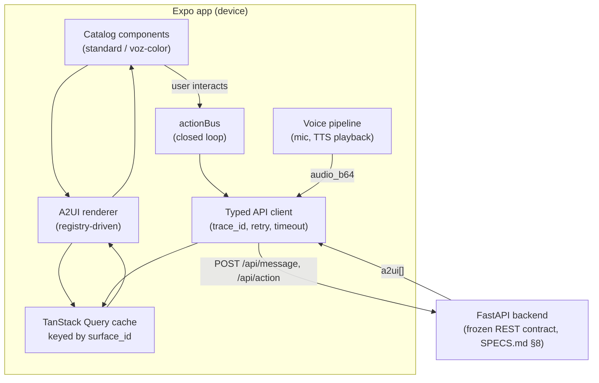

# MOBILE_ARCHITECTURE.md — Native Mobile Frontend Architecture

> **Authority:** `INVARIANTS.md` > `SPECS.md` > `AGENTS.md` > **this file**.
> This file is the architecture spec for this repository's native mobile frontend. It inherits every applicable invariant from `INVARIANTS.md` (INV-010, INV-016, INV-017, INV-023 in particular) and consumes only the frozen contract in `SPECS.md` §8. It does not redefine backend behavior.
>
> Scope of this document: **how the mobile app is built**, not what the product does. For product behavior, see `SPECS.md`. For the scope-change rationale (web → native mobile, Expo vs Tauri), see the `[2026-09-12] decision` entry in `CHANGELOG.md`.
>
> **Spanish companion:** `ARQUITECTURA_MOBILE.md` is a Spanish translation of this file with extra beginner-level explanations, aimed at junior developers on the team. It is **not authoritative** — if it ever disagrees with this file, this file wins.
>
> **Build state:** this document describes the design; `openspec/specs/mobile/` (baseline, deployed truth) and `openspec/changes/` (proposed, not yet built) track what is actually built vs. planned, and call out where the implementation deviated from or refined what's written here (e.g. the real A2UI wire protocol, NativeWind/Moti being dropped). Run `openspec list --specs` / `openspec list` before assuming something described below does or doesn't exist yet. See `AGENTS.md` §2a for the OpenSpec workflow.

---

## 0. Starting state

**This repository is frontend/mobile-only.** The backend (`SPECS.md`/`AGENTS.md` §3-§4's Python/FastAPI/MCP system) lives in a separate repository and is reached only over HTTP through the frozen contract in `SPECS.md` §8. This repo *is* the Expo app, at its root, not nested under a `/mobile` folder — scaffolded and committed as tracked in `openspec/specs/mobile/`. The earlier throwaway Vite/React web prototype (a Figma-to-code exercise, unrelated to `SPECS.md`) has been removed.

---

## 1. Stack decision (summary)

| Concern | Choice | Why |
|---|---|---|
| Framework | **Expo (React Native) + TypeScript**, strict mode | See `CHANGELOG.md` [2026-09-12]. Windows dev machines + Apple Developer account → EAS Build (cloud) + TestFlight beats Tauri's local-macOS-only iOS build. |
| Navigation | **Expo Router** (file-based) | Matches how the agent addresses screens by `surface_id`/domain; deep-linkable, minimal boilerplate. |
| Styling | Plain RN `StyleSheet` + `src/theme/tokens.ts` | NativeWind was evaluated and **dropped**: at build time it had open, maintainer-acknowledged stability issues with Reanimated v4/SDK54+. Not a component library either way, so this choice doesn't affect `INV-016`. |
| Animation | **react-native-reanimated v4** + **react-native-gesture-handler**, directly | Moti was evaluated and **dropped**: its Reanimated v4 compatibility was unconfirmed at build time. `src/theme/motion.ts` centralizes spring/timing presets so this doesn't mean ad hoc animation code. |
| State/data | **TanStack Query** (server cache) + **Zustand** (local/session/UI state) | A2UI surfaces are server-driven documents fetched/mutated over REST — Query's cache-by-key model maps directly onto `surface_id`. Zustand covers ephemeral UI state (recording indicator, active catalog, debug overlay). No Redux — unjustified ceremony at this scope. |
| Networking | Thin typed client over `fetch` (no axios) | One file, one retry/timeout policy, `trace_id` plumbing. A dependency here buys nothing `fetch` doesn't already give. |
| Secure storage | `expo-secure-store` | `session_id` persistence across app restarts. Nothing else is stored (no auth tokens — `INV` explicitly excludes auth). |
| Audio | **`expo-audio`** (never `expo-av`) | `expo-av` is deprecated since SDK 53 and gone from Expo Go starting SDK 55; we're on SDK 57. Mic capture for STT upload, playback for TTS `audio_ref`. |
| Build/ship | **EAS Build** (cloud) + **EAS Update** (OTA) + **TestFlight** / Play Internal Testing | No local Mac needed; instant iteration via `expo start` + Expo Go during the hackathon, polished installable build for the showcase via TestFlight (Apple Developer account already available). |
| Catalog | 100% custom, two variants (`standard`, `voz-color`) | `INV-016`. Built on RN primitives, not a component library. All 18 A2UI "basic" catalog node types implemented — see `openspec/specs/mobile/catalog-standard/` and `.../catalog-accessible/`. |

---

## 2. Directory layout (repo root)

This repository has no top-level `/mobile` folder — the repo root *is* the Expo app root (`app.json`/`app.config.ts` at root, same as any standalone Expo project):

```
/ (repo root)
  app/                          Expo Router routes (file-based)
    _layout.tsx                 Root layout: providers (QueryClient, SessionProvider, ThemeProvider)
    index.tsx                   Entry: creates/restores session, routes to first surface
    surface/[surfaceId].tsx     Generic A2UI surface screen — renders whatever the agent sent
    negotiation/[session].tsx   El Revés live negotiation screen
    saving-bags/index.tsx       Saving Bags list
    saving-bags/[id].tsx        Saving Bag detail/answer flow
    debug/kill-test/[surfaceId].tsx   Kill Test viewer (REQ-KT-01/02)
    debug/trace/[traceId].tsx   Trace inspector (dev build only)

  src/
    a2ui/
      types.ts                  A2UI v0.9.1 message/component TS types (mirrors a2ui-agent-sdk schema — do not hand-roll, generate or transcribe from spec)
      parser.ts                 Validates + normalizes an incoming a2ui[] array
      registry.ts                Component-type → renderer map (the "custom catalog" mechanism)
      renderer.tsx               <A2UISurface a2ui={...} /> — walks the tree via the registry
      actionBus.ts                Dispatches a2ui_action → POST /api/action, feeds response back into the surface cache

    catalog/
      standard/                 Default catalog components (Card, Stack, AmountField, Tradeoff, BreakAlert, NegotiationRound, Timeline, Button, TextInput, ...)
      voz-color/                Accessible catalog: high-contrast, icon-first, large-target variants of the same semantic components
      shared/                   Design tokens (colors, spacing, type scale) consumed by both catalogs
      index.ts                  Exports { standard, voz-color } registries keyed by catalog id

    features/
      session/                  Session bootstrap, restore, accessibility-profile detection (REQ-ACC-01)
      la-mesa/                  Debt intake, strategy tradeoff, BreakAlert + repair flow (REQ-LM-*)
      el-reves/                 Negotiation round UI, take-control action (REQ-LM-07/08)
      saving-bags/               Bag creation, inferred question form, research/feasibility display (REQ-BAG-*)
      voice/                     Mic capture, waveform/recording UI, STT upload, TTS playback + cache (REQ-ACC-03..05)
      caja-de-cristal/           "Why am I seeing this" panel + editable-assumption re-submit (REQ-CC-01/02)
      kill-test/                 Frozen-surface viewer, no agent calls (REQ-KT-*)

    api/
      client.ts                  Typed fetch wrapper: base URL by build profile, trace_id header, timeout/retry
      endpoints.ts                One function per REQ-API-* endpoint, typed request/response
      types.ts                    Wire types shared with the backend contract (hand-mirrored; see §7)

    state/
      session.store.ts            Zustand: session_id, accessibility profile, active catalog
      ui.store.ts                  Zustand: recording state, debug overlay, connectivity banner
      queryClient.ts               TanStack Query client + query-key conventions (see §6)

    theme/
      tokens.ts                    Color/spacing/typography tokens (source of truth for both catalogs)
      ThemeProvider.tsx

  assets/                         App icon, splash, static audio fallback cues
  app.config.ts                   Expo config: env-driven API base URL, EAS project id, bundle identifiers
  eas.json                        Build profiles: development, preview (internal), production (TestFlight/Play)
  tsconfig.json                   strict: true
  .env.example                    EXPO_PUBLIC_API_BASE_URL and any public-safe config only
```

---

## 3. Layered architecture



This is intentionally the same mental model as a web SPA — the only thing that changed with the Expo pivot is the render target (RN views instead of DOM), not the data flow. `INV-010` (HTTP-only) and `INV-017` (closed loop: every interaction returns to the agent as context) hold exactly as documented.

---

## 4. The A2UI runtime (the part that actually matters)

This is the highest-risk, highest-value piece of the mobile app — it is what makes the judging criteria "quality and adaptability of the generated UI" true or false. Design it first, polish visuals second.

**Registry pattern**, not a giant `switch`:

```ts
// src/a2ui/registry.ts
type A2UIComponentProps = { node: A2UINode; path: string };
type CatalogRegistry = Record<string /* node.type */, React.ComponentType<A2UIComponentProps>>;

export function createRegistry(entries: CatalogRegistry): CatalogRegistry {
  return entries; // validated against a2ui/types.ts component-type union at compile time
}
```

```ts
// src/a2ui/renderer.tsx
export function A2UISurface({ a2ui, catalogId }: { a2ui: A2UIMessage[]; catalogId: CatalogId }) {
  const registry = catalog[catalogId];
  return (
    <>
      {a2ui.map((node) => {
        const Component = registry[node.type];
        if (!Component) return <UnknownNodeFallback node={node} />; // never crash on an unrecognized node
        return <Component key={node.id} node={node} path={node.id} />;
      })}
    </>
  );
}
```

Rules that keep this honest (and testable against `INV-016`/`INV-017`):

1. **The registry is the only place component types are known.** Feature code never pattern-matches on `node.type`; it renders `<A2UISurface />` and lets the registry resolve it. This is what makes "swap catalog for accessibility" (`REQ-ACC-02`) a one-line prop change instead of a rewrite.
2. **Every interactive catalog component calls `actionBus.dispatch(name, sourceComponentId, context)` and nothing else.** No component owns business logic or talks to `api/client.ts` directly — that would leak `REQ-API-03`'s shape into forty files instead of one.
3. **`actionBus` always resolves with a fresh `a2ui[]` message array and applies it via the store, never reconstructing UI state itself.** Corrected from this document's earlier draft: the real A2UI protocol (`openspec/specs/mobile/a2ui-engine/spec.md`) is a normalized, patchable component graph — `updateComponents` upserts by id and `updateDataModel` patches by JSON Pointer, both of which can be incremental, not just full replacements. `REQ-LOOP-05` ("every HTTP mutation endpoint returns a full A2UI message array") is about the *endpoint response* always containing a complete message array, not about each individual message being a full-surface replace. Either way, the client stays dumb: it never invents structure, it only ever applies exactly what the backend sent.
4. **Unknown node types render a visible fallback, not a crash.** The backend and mobile catalog will drift during a 24h build; a graceful fallback is what keeps the golden-path demo alive when someone ships a new node type ten minutes before showtime.
5. **`a2ui/types.ts` is transcribed from the A2UI v0.9.1 spec (`AGENTS.md` §7 doc-fetch table), not invented.** If the backend uses `a2ui-agent-sdk` to validate outgoing payloads, the mobile types should be a direct mirror — mismatch here is the single most likely source of a broken demo.

---

## 5. Two catalogs, one semantic contract

`standard/` and `voz-color/` (`REQ-ACC-02`) must implement **the same set of node types** — a `BreakAlert` node renders in both, just very differently (compact card vs. full-bleed high-contrast panel with an attached TTS cue). Enforce this at compile time: both catalog modules export objects typed against the same `CatalogRegistry`, so a missing node type in either catalog is a TypeScript error, not a runtime surprise during the accessible-persona demo (`REQ-DEMO-03`).

`theme/tokens.ts` is the single source for both — accessible mode changes contrast/size/iconography, not the underlying palette source.

---

## 6. State & networking

- **Query keys are `["surface", surfaceId]` and `["saving-bag", bagId]` etc.** — one convention, mirrored from the backend's own entity model (`SPECS.md` §7/§9), so cache invalidation after an action is a single `queryClient.setQueryData` call in `actionBus`, not a fetch-refetch round trip.
- **No optimistic updates on the A2UI surface itself.** The backend is the source of structural truth (`INV-022`); rendering a guess before the real `a2ui[]` arrives risks showing UI the agent never actually decided on, which directly undermines the product's core thesis. Optimistic UI is fine for cosmetic-only things (e.g. a pressed-button state), never for structure.
- **`api/client.ts` generates a `trace_id` (or reads one echoed by the backend) and logs it locally in dev builds** so a broken demo step can be cross-referenced against `GET /debug/trace/{trace_id}` (`INV-018`) live, from the phone.
- **One client, one file.** Every `REQ-API-*` endpoint gets one typed function in `api/endpoints.ts`; nothing else in the app imports `fetch` directly. This is what keeps the contract "frozen" (`INV-023`) enforceable — a contract change becomes a one-file diff.

---

## 7. Voice pipeline (`REQ-ACC-03..05`)

1. Record via `expo-av`/`expo-audio` → base64 → `POST /api/message { session_id, audio_b64 }`.
2. Response's `audio_ref` (if present) is fetched once via `GET /api/audio/{asset_id}` and cached to the filesystem (`expo-file-system`) keyed by `asset_id` — mirrors the backend's own text-hash cache (`REQ-ACC-05`) so a repeated phrase never re-downloads.
3. Accessible-mode surfaces **auto-play** their `audio_ref` on arrival; standard-mode surfaces do not (this is the observable contrast `REQ-ACC-06` asks for — don't build a separate toggle for it, let the catalog switch be the whole mechanism).
4. Mic permission and playback are wrapped in one `useVoice()` hook so `features/voice/` is the only place that touches device audio APIs — everything else consumes `{ isRecording, start, stop, playAudioRef }`.

---

## 8. Caja de Cristal & Kill Test as catalog citizens, not special screens

Both are explicitly product features (`INV-004`), so they are **catalog node types**, not bolted-on app screens:

- `CajaDeCristalPanel` is a registry entry like any other; it renders whatever assumptions object the backend attached to the surface and, on edit, dispatches an action through the same `actionBus` — the "rebuild the outcome" behavior (`REQ-CC-02`) is just another `a2ui_action` round trip, no special-cased networking.
- `app/debug/kill-test/[surfaceId].tsx` calls `GET /debug/kill-test/{surface_id}` and feeds the result into the **exact same** `<A2UISurface />` component used everywhere else, with `actionBus` disabled (read-only). Reusing the real renderer — not a mock screen — is what keeps the Kill Test truthful (`INV-032`, `REQ-KT-02`).

---

## 9. Build & distribution

| Profile (`eas.json`) | Purpose | Distribution |
|---|---|---|
| `development` | Daily dev loop | Expo Go / dev client, instant reload, no build step |
| `preview` | Internal team QA during the 3 days | EAS Build → internal TestFlight group + Android internal testing link (QR/URL, no App Store review wait) |
| `production` | Showcase/demo build | EAS Build (cloud, no local Mac) → TestFlight (Apple Developer account already available) / signed Android build |

- `EXPO_PUBLIC_API_BASE_URL` switches per profile (`app.config.ts`) so the same build artifact never has to be rebuilt to point at a different backend host — coordinate this value with the backend repository/team (local dev machine URL during the build, then the Cloudflare-Tunnel-fronted showcase URL per that repo's own D1/showcase decision).
- Use **EAS Update** during the event for JS-only fixes (catalog bug, copy change) without a new native build/App Store round trip — native rebuild only when a native module changes.
- Internal TestFlight testing (not external) needs no Apple review wait; that's the path for the 3-day window. Reserve any external TestFlight/App Store submission for after the event if ever wanted — it's out of scope for the hackathon per `AGENTS.md` §2.

---

## 10. Testing (mobile-side, mapped to `AGENTS.md` §9's spirit)

- **Registry/renderer unit tests**: feed fixture `a2ui[]` payloads (one per node type, one with an unknown type) through `<A2UISurface />` and assert the right catalog component rendered — this is the test that actually protects the demo.
- **`actionBus` contract test**: asserts a dispatched action always replaces the cached surface with the response array wholesale (never merges).
- **One acceptance check per mobile-relevant `REQ-*`** in the same spirit as the backend's per-`REQ-*` test (`AGENTS.md` §9) — at minimum `REQ-LOOP-01..05`, `REQ-LM-05/06` (the two mutation moments), `REQ-ACC-02/06` (catalog switch), `REQ-KT-01/02`.
- Full device-automation E2E (Maestro/Detox) is **explicitly optional** — only add it if the golden path is stable with hours to spare; a flaky E2E harness the night before the demo is a net negative.

---

## 11. Suggested workstream split within this repo (~24h)

This repo's work splits into up to three parallel streams, independent of however many people the backend repository/team assigns on their side:

1. **A2UI runtime + standard catalog owner** — `src/a2ui/`, `src/catalog/standard/`, `src/catalog/shared/` tokens, `api/` client. This is the critical path; start immediately with hand-authored fixture `a2ui[]` payloads — **do not wait on the backend repo to be live.**
2. **La Mesa + El Revés feature owner** — `features/la-mesa/`, `features/el-reves/`, `features/caja-de-cristal/`. Consumes the runtime from stream 1 as soon as the registry exists, even against fixtures.
3. **Voice/Accessibility + Saving Bags owner** — `features/voice/`, `src/catalog/voz-color/`, `features/saving-bags/`, `features/kill-test/`.

All streams share `src/a2ui/types.ts` and `api/endpoints.ts` as the integration seam with the backend — lock those two files' shape early (even as a stub transcribed from the A2UI spec and `SPECS.md` §8) so streams 2–3 don't stall, and so integration with the backend repository is a drop-in once its base URL is available (`EXPO_PUBLIC_API_BASE_URL`, §9).

**Cross-repo coordination:** agree on the `a2ui[]` message shape and the `SPECS.md` §8 endpoint contracts with the backend team *before* either side writes code against assumptions — a schema mismatch discovered on day 3 is the single biggest risk to the golden-path demo (`SPECS.md` §11).

---

## 12. Risk register (mobile-specific, additive to `CHANGELOG.md`'s existing risks)

- **Catalog drift between `standard` and `voz-color`.** Mitigated by the shared `CatalogRegistry` type (§5) — a missing node type fails the TypeScript build, not the accessible-persona demo.
- **A2UI schema drift between backend and mobile.** Mitigated by treating `a2ui/types.ts` as transcribed-from-spec, not invented, and by the graceful-fallback rule (§4.4).
- **EAS Build queue time on free/low tier during the final hours.** Mitigate by doing the first `production`-profile build early (day 2, not day 3) to surface signing/config issues before they're on the demo's critical path.
- **Mic/audio permissions on physical devices differ from simulator.** Test the voice pipeline on a real device on day 1, not day 3 — simulators frequently mask permission-prompt and audio-session issues.
